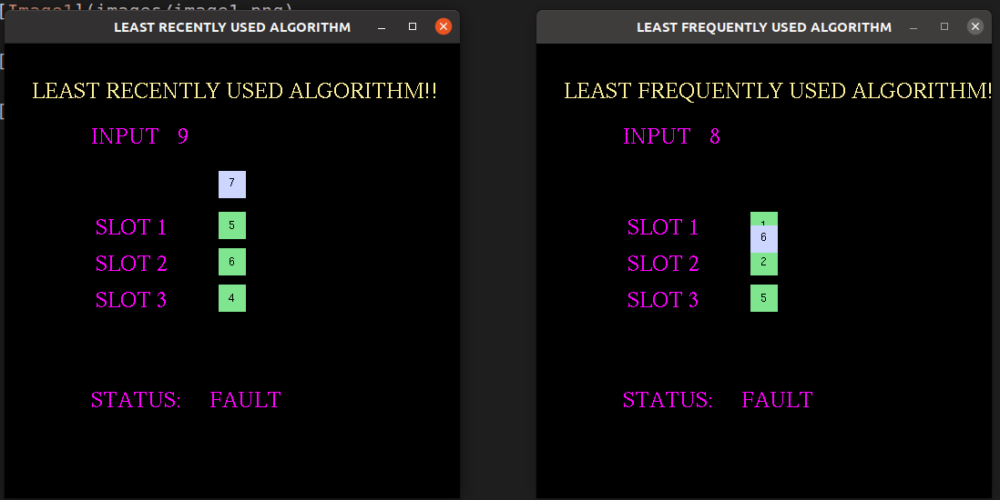

# Page Replacement Algorithm Visualization

A simple demonstration of Page Replacement algorithms LRU and LFU.
I have used OpenGL Library for creating the graphics and arrays for the implementation of the two algorithms.
In an operating system that uses paging for memory management, a page replacement algorithm is needed to decide which page needs to be replaced when new page comes in. 

Page Fault – A page fault happens when a running program accesses a memory page that is mapped into the virtual address space, but not loaded in physical memory. 

LRU is the least recently used page replacement algorithm (Least recently used), which is the first time to eliminate the longest unused pages!

LFU is the most infrequently used page replacement algorithm (Least frequently used), which is the least visited page in a certain period of time!

## To run the code

```
make
./gl
```

## Screenshots
Here are a few screen shots of the graphic developed and the terminal output as well.





